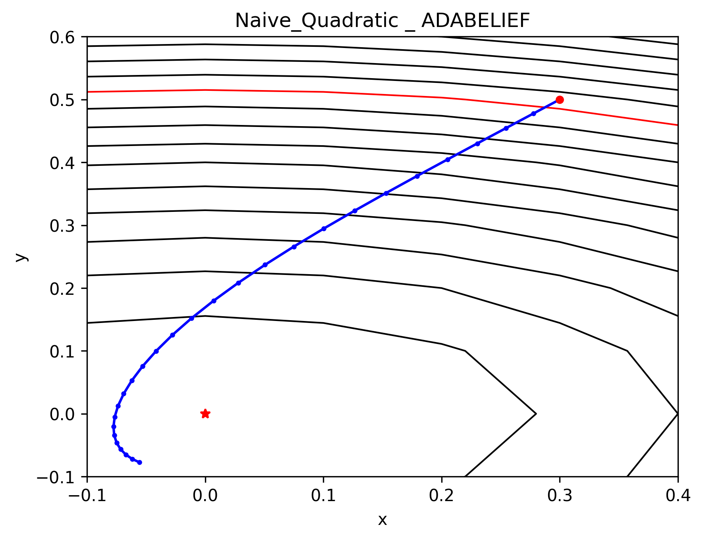
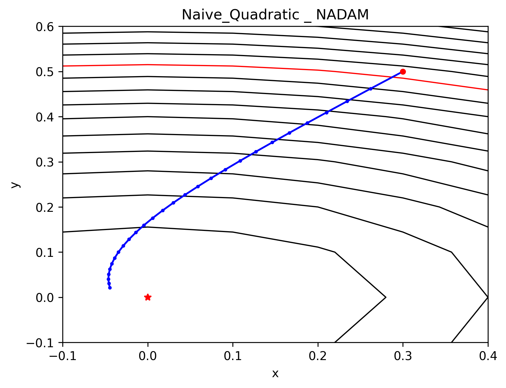
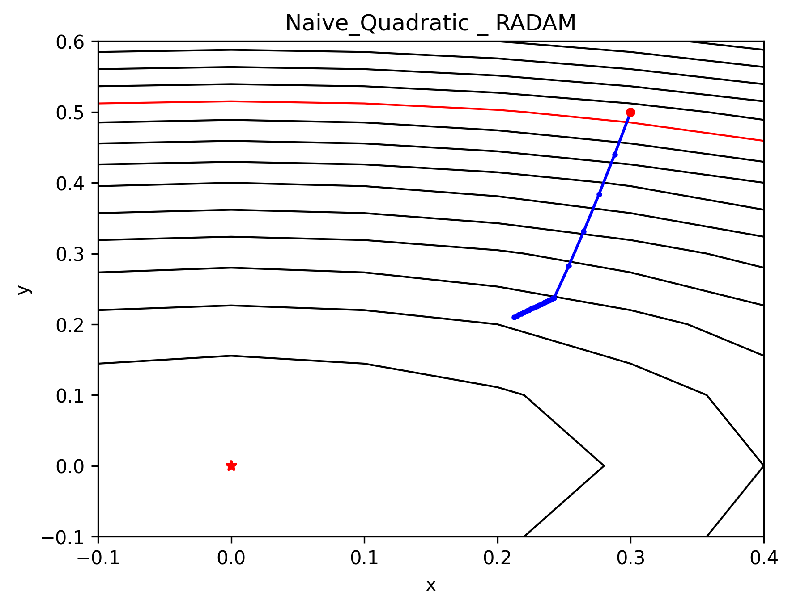
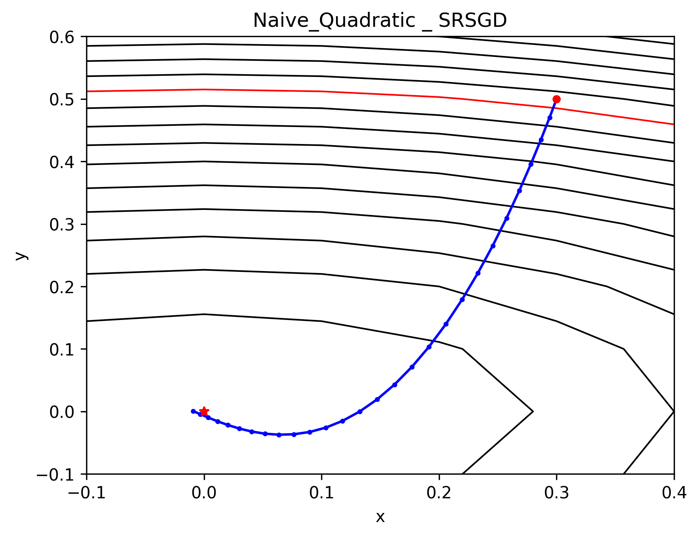
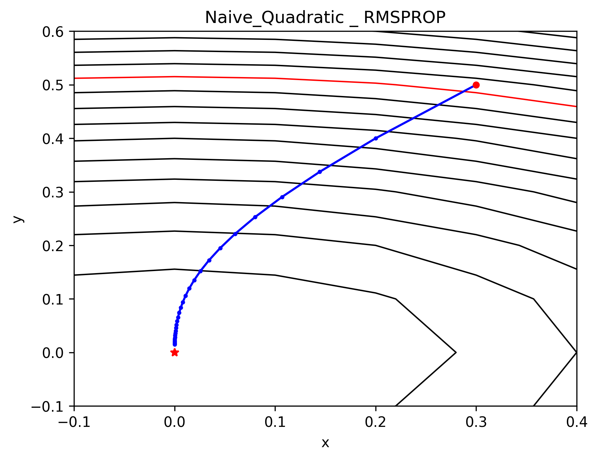
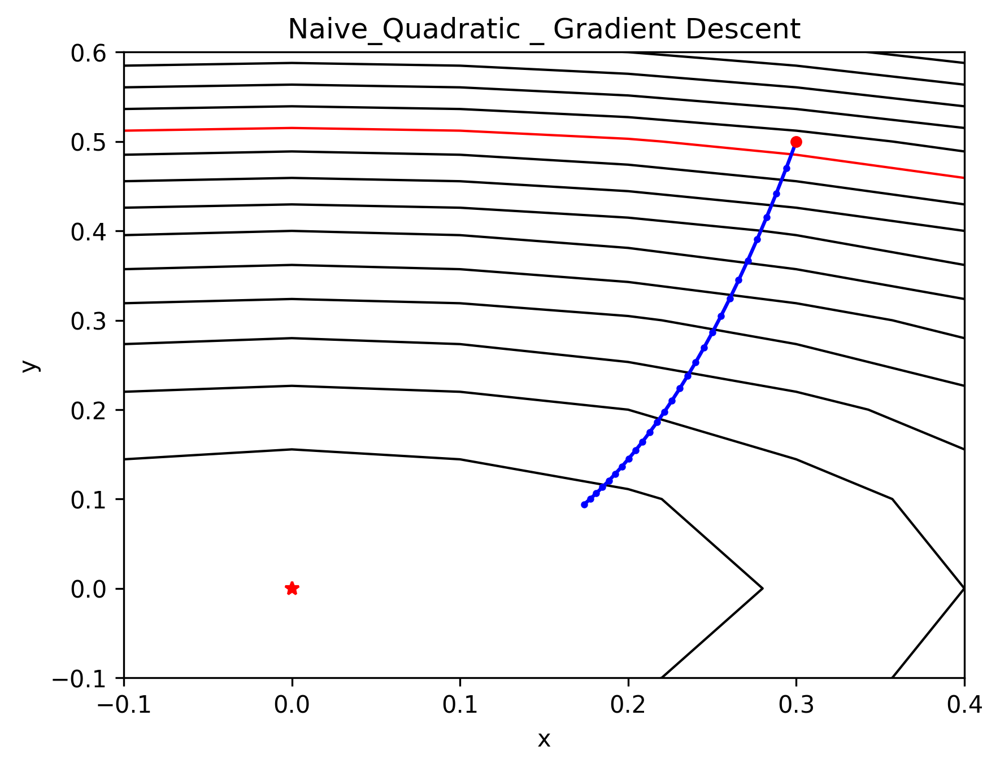
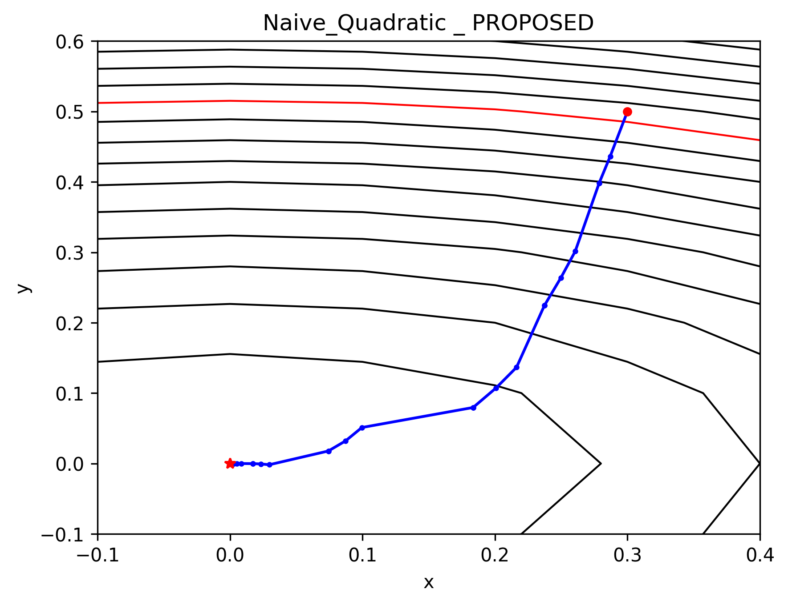

# Spawn Gradient Descent (SpGD)
*Official Python implementation of the manuscript "Spawning Gradient Descent (SpGD): A Novel Optimization Framework for Machine Learning and Deep Learning" by Moeinoddin Sheikhottayefe, Zahra Esmaily, and Fereshte Dehghani.*

## Overview
Spawning Gradient Descent (SpGD) is a novel optimization algorithm that improves gradient-based methods by addressing common challenges like zigzagging, suboptimal initialization, and manual learning rate tuning. SpGD introduces dynamic learning rate adjustment through Augmented Gradient Descent (AGD), controlled randomization for better exploration, and optimized movement patterns for enhanced convergence. It achieves remarkable accuracy on benchmarks, such as a near-zero error (1.7e-11) on convex functions like Quadratic, and significantly better proximity to global optima on non-convex functions like Ackley. SpGD also excels in deep learning tasks, achieving faster convergence and higher accuracy—e.g., 85% accuracy on CIFAR-10 in just 20 epochs using DenseNet-19, demonstrating its efficiency in large-scale neural network training and challenging optimization tasks.

----
## Provided Methods
The implementation includes the following optimization methods:
- Adabelief
- Adam
- Nadam
- RAdam
- Momentum
- SRSGD
- RMSprop
- GD (Gradient Descent)
- SpGD (Proposed Method)

## Fixed Starting Point Evaluation

To evaluate and display the performance of various methods with a fixed starting point, run the following code:

    python Compare_Fix_Init_Point.py
  
By default, a simple quadratic function is used as the test function, with the initial starting point set to ‍‍‍‍`[0.0, 0.5]`. However, you can select any of the following functions:
- Naive_Quadratic (default)
- Matyas
- Rosenbrock
- Ackley
- Schaffer
- Rastrigin
- Levy

For most functions, the starting point should be selected within the range of 0.0 to 1.0 or within the defined bounds for them. 

You can specify these arguments using `--function_name` and `--initial_point` as follows:

    python Compare_Fix_Init_Point.py --function_name <function_name> --initial_point <initial_point>

    

If you encounter the following issue: "A module that was compiled using NumPy 1.x cannot be run in NumPy 2.0.0 as it may crash." Use numpy==1.26.4.
If you encounter an error during execution, especially for the Rastrigin function in the proposed method, disable the break command.

)

  Figure: Plot of points obtained by various methods on the quadratic function with a fixed starting point of [0.0, 0.5] over 27 steps.

## Random Starting Point Evaluation

To evaluate and display the performance of various methods with random starting points over 100 iterations, run the following code:

    python Compare_Random_Init_Point.py
  
Here too, by default, a simple quadratic function is used as the test function. However, you can change this by selecting the desired function name as follows:

    python Compare_Random_Init_Point.py --function_name <function_name>

## Random Starting Point Evaluation with considering an epsilon value for

----
## CIFAR Dataset Testing

For testing on the **CIFAR** dataset, we based our implementation on the existing code from the [SRSGD](https://github.com/minhtannguyen/SRSGD) method. Our optimizer is defined in the `spawngd.py` file located in the *optimizers* folder. 

Experiments were conducted on the *ResNet* and *DenseNet* models. The trained models are stored in the *checkpoint* directory. To compare different methods and view the results, you can run the `SPAWNGD.ipynb` notebook. 

All materials related to the CIFAR dataset testing are available through this [Google Drive link](https://drive.google.com/drive/folders/1jp--CqS57AgXeLgCOx1HfgFDYy_c7pCo?usp=drive_link).
